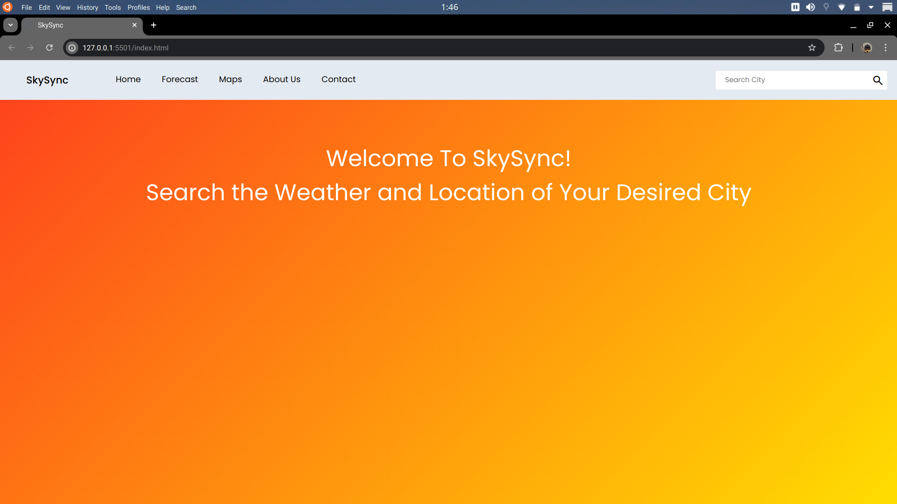

# SkySync

## Table of Contents
- [Overview](#overview)
- [Features](#features)
- [Technologies Used](#technologies-used)
- [Screenshots](#screenshots)

## Overview

SkySync is a user-friendly website that allows users to check the current weather conditions for any location. It provides real-time weather data and time with a simple interface for easy navigation.

## Features

- **Current Weather**: Get real-time weather updates for any location.
- **Local Date & Time**: It Provides the User with the Local Date & Time of the City Searched.
- **City Location**: You can find the Location of the City searched along with its weather. 
- **Search Functionality**: Easily search for cities to find their weather information.
- **Dynamic Background and Icon Customization**: The Background of the app and image representing weather change dynamically to represent different weather conditions.
- **Responsive Design**: Works seamlessly on both desktop and mobile devices.

## Screenshots



## Technologies Used

- HTML
- CSS
- JavaScript
- [Weather API](https://openweathermap.org/api) 

## Installation

1. Clone the repository:
   ```bash
   git clone https://github.com/yourusername/weather-app.git
